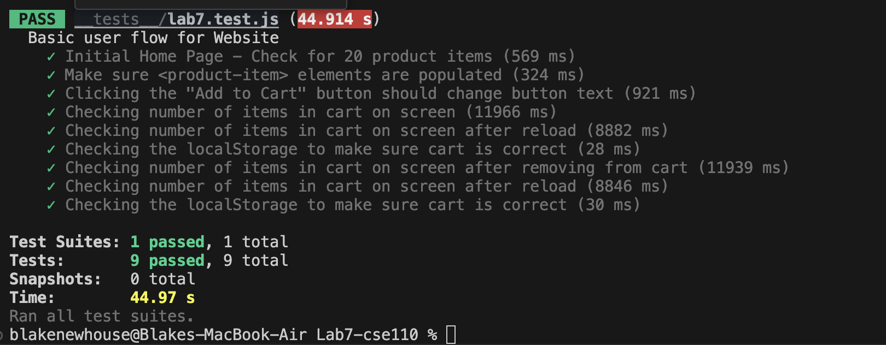

Blake Newhouse

Check your understanding:

1. I would put them within a Github action that runs whenever code is pushed. This way, the code must be tested before being pulled to any other branches, and it will automatically run without needing programmers to manually test it themselves. Additionally, it ensures that whenever code is somewhat finalized it will be tested.

2. No. That would be a unit test, end to end testing is instead used to test user actions/inputs.

3. The main difference is that the Navigation mode provides a more in depth review of the website with ratings on scales of 0-100, valued with different metrics and providing a multitude of diagnostics that can help improve the webpage. The Snapshot mode provides a short "snapshot" that only checks a few things, returning a number X/4 or X/5 for each catagory, where X is the number of successful disagnostics passed out of a small total, such as 4 or 5.

4. The main issues with the website are with the SI(speed index). Three ways to improve that are as follows: 
   1. properly size images to save cellular data and decrease loading times
   2. convert images into newer formats like WebP and AVIF, which are better compressed when compared to PNG and JPEG
   3. Insert a HTML `<meta name="viewport">` tag which will reduce delay after user input and optimize the website for mobile usage.

